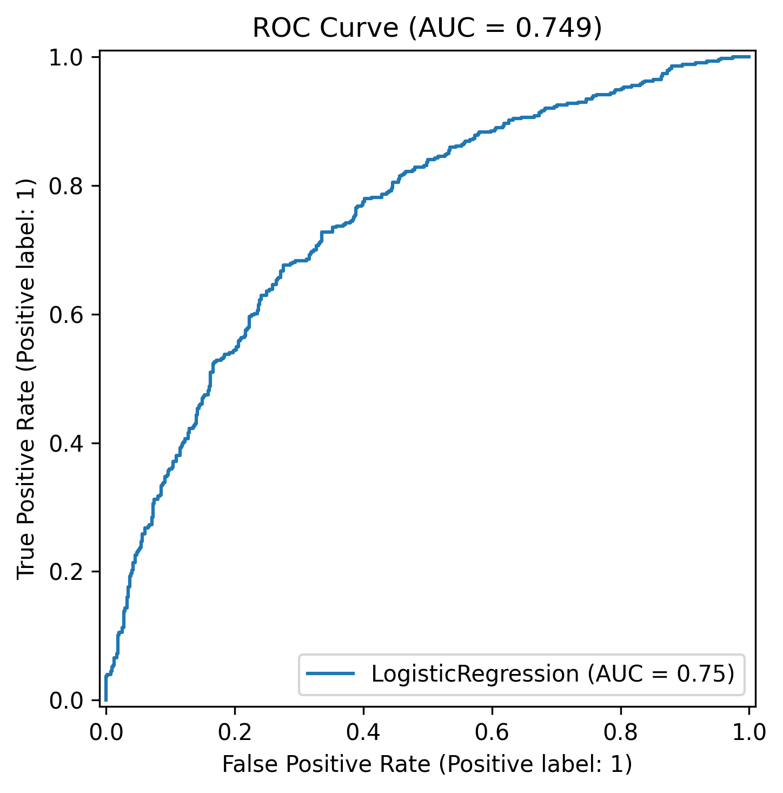
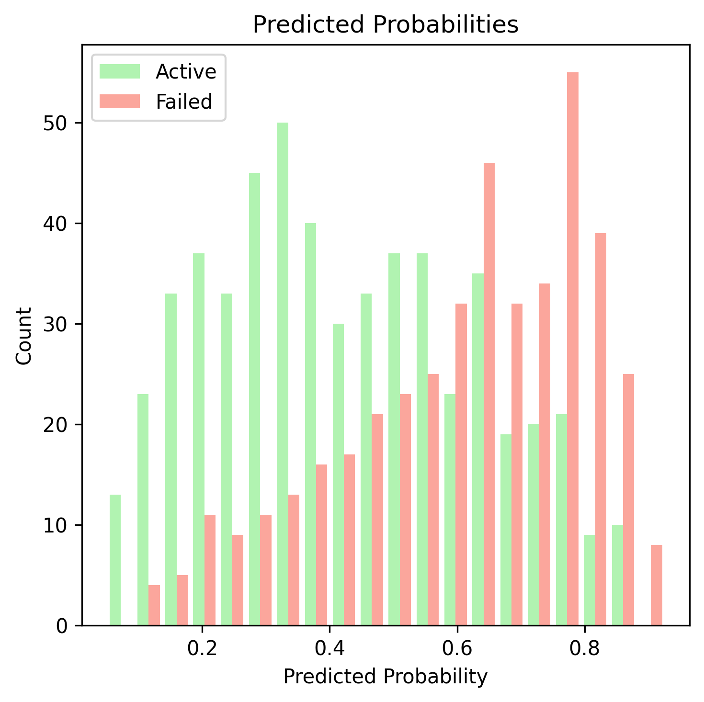
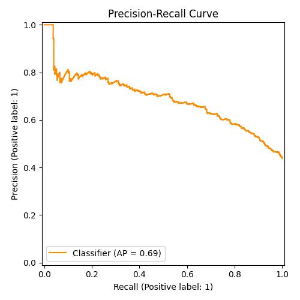
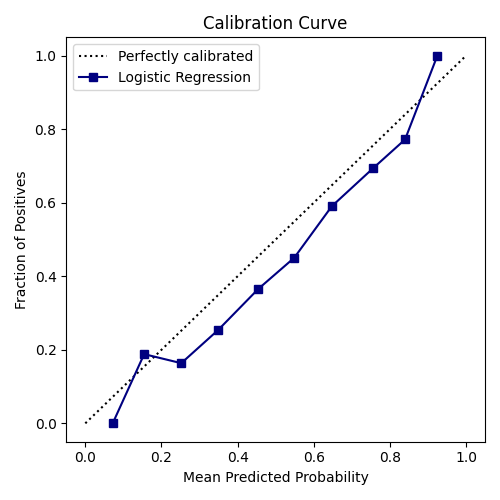
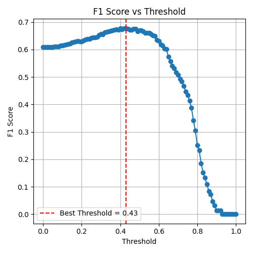
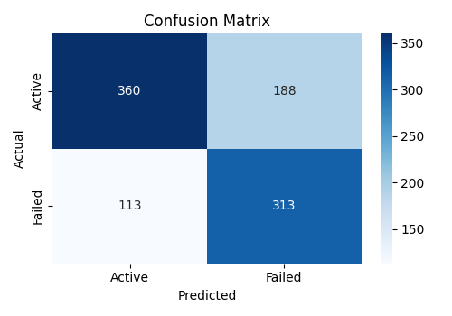

# Startup Failure Prediction

## Project Summary

**Goal:** Predict if a startup will fail after its last funding round.  
**Model:** Logistic Regression.  
**Dataset:** tartups (filtered), features include funding, market, country, state, and funding type flags.  

**Key Results (Test Set):**  
- **Accuracy:** 0.72  
- **ROC-AUC:** 0.749  
- **Best F1 threshold:** 0.43 (used 0.5 for final predictions)

### Model Evaluation
----
#### **1. ROC-Curve:**  

  

The ROC curve shows how well the model distinguishes between active and failed startups. With an AUC of 0.749, the model demonstrates good discriminatory power. A perfect model would reach the top-left corner.

#### **2. Predicted Probability Histogram:**  

  

The histogram shows the distribution of predicted probabilities for both classes. Ideally, we expect two clearly separated peaks, one near 0 (active startups) and another near 1 (failed startups).

In this model, the peaks are distinguishable but overlap slightly, suggesting that while most predictions are accurate, there remains some uncertainty in borderline cases.

#### **3. Precision-Recall Curve:**  

  

The Precision-Recall curve illustrates how the model balances identifying failed startups (recall) while keeping predictions accurate (precision).

The curve starts with very high precision for a small subset of predictions, then gradually declines as recall increases, stabilizing around moderate precision at full recall.

This behavior indicates that the model is particularly confident in detecting clear failure cases, while uncertainty increases for borderline startups.

#### **4. Calibration Curve:**  

  

The calibration curve compares the model’s predicted probabilities with the actual observed outcomes.

We see that the curve stays slightly below the diagonal, meaning the model tends to be under-confident, it predicts slightly lower probabilities than the true likelihood of startup failure.
Still, the curve follows the ideal line fairly closely, indicating that the model’s probability estimates are generally well-calibrated.

#### **5. F1-Score Otimization:**  

  

This plot illustrates how the F1 score changes as we vary the classification threshold.

We observe a clear peak around the optimal threshold, where the balance between precision and recall is maximized.

The red dashed line marks this best point (~0.43), but for practical consistency across models, we keep the threshold at 0.5, accepting a slightly lower F1 in exchange for a more interpretable and standardized decision boundary.

#### **6. Confusion Matrix:**  

  

We can see that the model correctly identifies a majority of both active (360/548) and failed (313/426) startups.

There are some misclassifications, with slightly more active startups incorrectly labeled as failed (188) than failed startups mislabeled as active (113).

Overall, the model demonstrates a reasonable balance between sensitivity (recall for failed startups) and specificity (recall for active startups).

#### **Takeaway:**  
- Higher total funding, more funding rounds, and certain markets/states are associated with lower failure risk.  
- Logistic regression provides a stable, interpretable model with reasonable predictive performance.

## 1. Introduction
### Project Motivation
Startups are exciting, but also risky. Many fail within the first few years, and predicting which ones might struggle can help investors, founders, and stakeholders make better decisions. In this project, I explore how machine learning can be used to estimate the likelihood of a startup failing.

### Objective
The goal of this project is to build a model that predicts whether a startup will fail (shutdown) within a certain time frame after its last funding round. This is a binary classification problem, where the model outputs the probability of failure for each company.

### Problem Definition
- **Type of problem:** Binary classification .
- **Model choosed:** Logistic Regression.  
- **Target variable:** `failure` (1 if the startup fails, 0 otherwise). 
- **Scope:** Focus on building a simple, interpretable model that can provide actionable insights, not just predictions.

### Why this project?
This project allows me to apply key concepts learned in the course, such as logistic regression, feature engineering, and evaluation metrics like ROC-AUC and F1-score.  
Additionally, given my background in fintech and experience analyzing risk and performance for financial operations, I am particularly interested in how data-driven models can help assess the viability and risk of businesses. This gives me the chance to combine my professional knowledge with machine learning techniques in a meaningful way.

## 2. Data Source

For this project, I used a publicly available dataset from Kaggle.  
[Startup Investments Dataset](https://www.kaggle.com/datasets/arindam235/startup-investments-crunchbase)  

### Columns Description
Here are the final columns used in the analysis and modeling:

- **market:** Categorical variable indicating the industry or market sector in which the startup operates.  
- **funding_total_usd:** Numerical variable showing the total amount of funding (in USD) raised by the startup.  
- **country_code:** Categorical variable representing the country where the startup is based (non-US startups were labeled as `"FGN"`).  
- **state_code:** Categorical variable representing the U.S. state where the startup is located.  
- **funding_rounds:** Number of funding rounds the startup has completed.  
- **founded_at:** Date when the company was founded.  
- **first_funding_at:** Date of the startup’s first funding round.  
- **last_funding_at:** Date of the startup’s most recent funding round.  
- **seed:** Amount of money (in USD) raised through seed funding.  
- **venture:** Amount raised through venture capital funding.  
- **equity_crowdfunding:** Amount raised through equity crowdfunding platforms.  
- **undisclosed:** Amount from undisclosed funding rounds.  
- **convertible_note:** Amount raised through convertible note financing.  
- **debt_financing:** Amount raised through debt financing.  
- **angel:** Amount raised from angel investors.  
- **grant:** Amount received through grants.  
- **private_equity:** Amount raised through private equity investments.  
- **post_ipo_equity:** Amount raised after IPO through equity offerings.  
- **post_ipo_debt:** Amount raised after IPO through debt financing.  
- **secondary_market:** Amount raised through secondary market transactions.  
- **product_crowdfunding:** Amount raised through product crowdfunding campaigns.  
- **round_A-to-H:** Amount raised across later-stage venture rounds (Series A to H).  
- **status:** Categorical variable indicating the startup’s final state (e.g., operating, acquired, closed, IPO).  
  - Used to create the binary target variable **`failed`**:
    - `1` → Startup closed (failed)  
    - `0` → Startup acquired (success)

## 3. Data Cleaning & Preprocessing

The dataset has been cleaned and prepared for analysis and modeling. Key steps include:

### 3.1 Data Validation
- Standardized all column names to lowercase and replaced spaces with underscores for consistency.  
- Removed irrelevant or high-cardinality columns, such as `name`, `homepage_url`, and `region`.  
- Filtered the dataset to include only startups with a final status of either **acquired** or **closed**.  
- Created a new binary target variable:
  - `failed = 1` → startup **closed**
  - `failed = 0` → startup **acquired**

### 3.2 Date and Currency Formatting
- Converted date columns (`founded_at`, `first_funding_at`, `last_funding_at`) into datetime format.
- Standardized the `funding_total_usd` column by removing commas, converting to lowercase, and coercing invalid values to numeric.
- Startups not based in the United States had their `state_code` and `country_code` replaced with `"FGN"` (foreign).

### 3.3 Handling Missing Values
- Removed rows missing `first_funding_at`, as this date is essential to determine the startup’s funding history.  
- Replaced missing categorical values in `market` with `"Unknown"`.  
- Created a flag variable `founded_missing` to indicate startups without founding date information.  
- Imputed missing numeric date features:
  - `founded_year` → filled with the median.
  - `founded_month` → filled with the mode.
- Replaced missing funding values with `0` to indicate no funding received.

### 3.4 Feature Engineering
- **months_to_first_funding:** calculated the number of months between the founding date and the first funding round.  
- **funding_duration_months:** calculated how long (in months) the startup received funding (difference between first and last funding dates).  
- Dropped redundant date columns (`founded_at`, `first_funding_at`, `last_funding_at`) after deriving the new time-based variables.

### 3.5 Feature Classification
At the end of the preprocessing stage, features were categorized into:

- **Categorical variables:** `market`, `country_code`, `state_code`
- **Numerical variables:** `funding_total_usd`, `funding_rounds`, `months_to_first_funding`, `funding_duration_months`, etc.

This clean and structured dataset formed the foundation for model training and evaluation.

## 4. Feature Engineering

Feature engineering played a key role in improving data quality and creating variables that better represent the business reality of startups. This step focused on selecting relevant features, reducing noise, and improving model interpretability.

### 4.1 Data Filtering
- Removed startups founded before the year **2000**, as they represent outdated business dynamics and a very small portion of the dataset.
- Ensured logical consistency by filtering startups where:
  - The first funding year is not earlier than the founding year.
  - The last funding year is not earlier than the first funding year.
  - The number of months to first funding (`months_to_first_funding`) is non-negative.

### 4.2 Categorical Features
- Standardized all categorical variables by converting text to lowercase and replacing spaces with underscores.
- Grouped less frequent categories into “**other**” to reduce cardinality and simplify modeling:
  - **market:** kept the top 25 markets (covering ~70% of startups).
  - **state_code:** kept the top 12 U.S. states (covering ~90% of startups).
- Final categorical variables:  
  `market`, `country_code`, `state_code`

### 4.3 Numerical Features
- Conducted descriptive analysis of all numerical attributes to identify potential outliers and scaling needs.
- Aggregated investment-related columns to create new indicators:
  - Calculated **total investment per startup** (`funding_total_usd`).
  - Created **binary flags** for each type of funding (e.g., `received_seed`, `received_venture`, etc.), indicating whether the startup received that type of investment.
- Dropped individual funding round columns (`round_A` to `round_H`) after aggregation, as their information was already captured in the total and flags.

### 4.4 Log Transformations
- Applied logarithmic transformation (`log1p`) to skewed numerical variables:
  - `funding_total_usd`
  - `months_to_first_funding`
  - `funding_duration_months`
- This transformation helps stabilize variance and reduce the impact of extreme funding values.

### 4.5 Final Feature Sets
After preprocessing and feature engineering, the dataset was organized into three main groups:

- **Categorical:**  
  `market`, `country_code`, `state_code`

- **Numerical:**  
  `funding_total_usd`, `funding_rounds`, `founded_year`, `founded_month`,  
  `first_funding_year`, `first_funding_month`, `last_funding_year`, `last_funding_month`,  
  `months_to_first_funding`, `funding_duration_months`

- **Flags (binary indicators):**  
  `received_seed`, `received_venture`, `received_equity_crowdfunding`, `received_undisclosed`,  
  `received_convertible_note`, `received_debt_financing`, `received_angel`, `received_grant`,  
  `received_private_equity`, `received_post_ipo_equity`, `received_post_ipo_debt`,  
  `received_secondary_market`, `received_product_crowdfunding`, `founded_missing`

This structured feature set provided a solid foundation for the model training and evaluation phase.

## 5. Exploratory Data Analysis (EDA)

Exploratory Data Analysis was conducted to understand the dataset and uncover patterns that could inform feature selection and modeling.

### 5.1 Failure Distribution
- Approximately **40% of startups failed** (`failed = 1`) and **60% survived** (`failed = 0`), showing a slightly imbalanced dataset.
- Visualization (bar chart) highlights the proportion of failed vs. active startups.
- Interpretation: The market is competitive, but most startups survive or are acquired, providing a balanced target for modeling.

### 5.2 Numerical Feature Distributions
- Histograms and boxplots were used to examine the distribution of all numerical features.
- Most monetary and duration-related variables are right-skewed, typical for startup funding data.
- Logarithmic transformation (`log1p`) was applied to `funding_total_usd`, `months_to_first_funding`, and `funding_duration_months` to reduce skewness and stabilize variance.
- Outliers are present but meaningful (e.g., exceptionally funded startups) and were kept for analysis.

### 5.3 Relationship Between Numerical Features and Failure
Key observations from boxplots comparing numerical features to the target variable:

- **funding_total_usd:** Startups that survived consistently received higher funding, indicating that greater funding reduces the likelihood of failure.
- **funding_rounds:** Failed startups mostly had only 1 funding round, while successful ones had multiple rounds, showing that maturity matters.
- **months_to_first_funding:** Surviving startups sometimes took slightly longer to get the first funding, suggesting that rapid early funding does not guarantee success.
- **funding_duration_months:** Failed startups often had very short funding durations, while successful ones had longer and more dispersed funding intervals.

**Interpretation:** Financial variables clearly differentiate failed vs. successful startups and are strong predictors for the logistic regression model.

### 5.4 Relationship Between Categorical Features and Failure
Key insights from barplots comparing categorical features to failure:

- **Country:** US-based startups show a lower failure rate (~39%) compared to foreign startups (~59%).  
- **US States:** Florida (58%) and Illinois (53%) exhibit higher failure rates relative to other states.  
- **Markets:** Industries such as Music (68%), Public Relations (65%), Social Media, and Clean Technology (61%) have the highest failure rates.

**Interpretation:** Geography and market sector are important predictors of startup success, highlighting patterns that logistic regression can leverage.

### 5.5 Summary of EDA Insights
- Financial variables (total funding, number of rounds, funding duration) are strong indicators of success.  
- Some categorical features (market, country, state) also influence failure probability.  
- Outliers and extreme funding values are meaningful and retained.  
- Overall, both numerical and categorical features provide a solid foundation for modeling startup failure.

## 6. Preparing the Dataset

Before training the model, the dataset was carefully prepared to ensure proper splits, normalization, and encoding.

### 6.1 Train, Validation, and Test Split
- The dataset was split into **training, validation, and test sets**:
  - **Training set:** 60% of the data (after splitting full train and validation).  
  - **Validation set:** 20% of the data, used for hyperparameter tuning and model selection.  
  - **Test set:** 20% of the data, used for final evaluation.  
- The target variable (`failed`) was separated from the features in all splits.
- Reset indices to ensure clean dataframes after splitting..

### 6.2 Normalization and Standardization
- Numerical features were standardized using **StandardScaler**:
  - Each feature was centered to zero mean and scaled to unit variance.
  - Scaling was fitted on the training set and applied to all splits to maintain consistency.
- Standardized numerical features include:
  - `funding_total_usd`, `funding_rounds`, `founded_year`, `founded_month`,  
    `first_funding_year`, `first_funding_month`, `last_funding_year`, `last_funding_month`,  
    `months_to_first_funding`, `funding_duration_months`

### 6.3 One-Hot Encoding of Categorical Features
- Categorical variables (`market`, `country_code`, `state_code`) were transformed into **one-hot encoded vectors**.
- The process used **DictVectorizer**, which converts each record into a dictionary of feature-value pairs, then encodes them as a numerical array.
- One-hot encoding was fitted on the training set and applied consistently to all splits (train, validation, test, full train).

### 6.4 Final Feature Matrices
After preprocessing, each dataset split was ready for modeling:

- **X_train / y_train:** Features and target for model training  
- **X_val / y_val:** Features and target for hyperparameter tuning  
- **X_test / y_test:** Features and target for final evaluation  
- **X_full_train / y_full_train:** Entire training set for model retraining after validation

## 7. Model Training and Evaluation

The predictive model was built using **Logistic Regression**, chosen for its interpretability and simplicity.

### 7.1 Logistic Regression (Baseline Model)
- A baseline logistic regression model was trained on the training set (`X_train`, `y_train`) and evaluated on the validation set (`X_val`, `y_val`).
- **Parameters used initially:**  
  - `C = 1.0` (regularization strength)  
  - `max_iter = 10000`  
  - `class_weight = 'balanced'` (to handle slight class imbalance)
- **Metrics on validation set:**  
  - Accuracy: ~0.71  
  - ROC-AUC: ~0.742  
  - Confusion matrix showed reasonable separation between failed and active startups.

### 7.2 K-Fold Cross-Validation
- **5-fold cross-validation** was performed to assess model stability:
  - The dataset was split into 5 folds; each fold was used once as a validation set while training on the remaining 4 folds.
  - Standardization and one-hot encoding were applied within each fold to prevent data leakage.
- **Results:**  
  - Mean ROC-AUC: 0.742 ± 0.015  
  - Small variation across folds indicates good generalization and no overfitting.

### 7.3 Hyperparameter Tuning
- Tested different regularization strengths (`C`) and penalties (`l1` and `l2`) on the validation set:
  - `C` values: [0.01, 0.1, 1, 10]  
  - Penalties: `l1` and `l2`  
- **Outcome:**  
  - Best performing configuration: `C = 0.1` (L1 or L2), ROC-AUC ~0.755  
  - L2 penalty was chosen for simplicity and stability.

### 7.4 Final Logistic Regression Model
- The final model was trained on the **full training set** (`X_full_train`, `y_full_train`) using the best hyperparameters (`C = 0.1`, `penalty = 'l2'`).
- **Test set performance:**  
  - Accuracy: 0.72  
  - ROC-AUC: 0.749  
  - Confusion matrix indicated good separation between failed and active startups.
- The model demonstrates stable performance and generalizes well to unseen data.

### 7.5 Evaluation Metrics and Visualization

#### ROC Curve
- Shows the model's ability to distinguish between active and failed startups.
- AUC = 0.749 indicates decent discriminatory power.

#### Predicted Probabilities
- Histogram of predicted probabilities for both classes shows distinguishable peaks for active (~0) and failed (~1) startups.
- Some overlap exists, indicating reasonable but not perfect separation.

#### Precision-Recall (PR) Curve
- Highlights trade-off between precision and recall.
- High precision at low recall thresholds, typical for datasets with class imbalance.

#### Calibration Curve
- Compares predicted probabilities with actual outcomes.
- Slight under-confidence observed: predicted probabilities are slightly below the observed fraction of positives.

#### F1 Score vs Threshold
- Evaluated F1 score across thresholds from 0 to 1.
- Maximum F1 observed at threshold ~0.43.
- For simplicity and more sensitive detection, threshold of 0.5 was used in final predictions.

### 7.6 Summary
- Logistic regression provides a simple, interpretable model for predicting startup failure.
- Financial features (funding, rounds, durations) and categorical features (market, country, state) are strong predictors.
- The model performs well on validation and test sets, with stable ROC-AUC, reasonable accuracy, and well-calibrated probabilities.
- Threshold tuning provides flexibility for decision-making depending on the sensitivity required in production.
